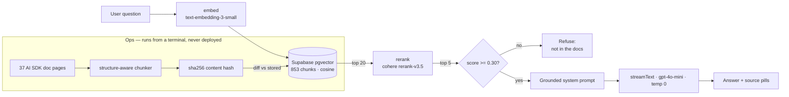

# docs-copilot

A RAG assistant over the Vercel AI SDK documentation. Ask it a question about the SDK
and it answers from 853 indexed chunks of the real docs, with clickable source pills —
or refuses, when the docs don't cover it.

**Live:** https://docs-copilot-w89t.vercel.app/

The interesting part isn't that it works. It's that every design decision below was
made by measuring the alternative.

---

## Measured results

| Change | Before | After | How it was measured |
|---|---|---|---|
| Structure-aware chunking | 0.546 | **0.643** | Top-1 cosine similarity, same content, same query, only chunk boundaries differ |
| Cohere reranking | — | **2 of 6** | Queries where vector search ranked the right chunk below a worse one, fixed by the cross-encoder |
| Answerable vs unanswerable score gap | ~1.7× | **~8×** | Widening this gap is what makes a threshold able to separate the two |
| Idempotent ingestion | 853 embeds | **154** | Re-ingest after real upstream doc drift — 82% fewer embedding calls |

**Retrieval threshold was calibrated, not guessed.** Cosine similarity needed 0.45 to
separate answerable from unanswerable queries; after reranking the useful cut moved to
0.30, because rerank scores are distributed differently. Reusing the old number would
have silently rejected good results.

---

## Architecture



**Retrieve wide, then narrow.** Vector search is fast but ranks by embedding proximity,
which is not the same as relevance. Pulling 20 candidates and letting a cross-encoder
re-score them recovers cases where the right chunk was buried at rank 8. The threshold
then runs on the *rerank* score, not the cosine score — the reranker is the component
that actually knows what relevance means.

**Two-layer refusal.** A numeric gate drops low-scoring chunks before the model sees
them, and the system prompt instructs refusal when context is empty. Either alone
leaks: the gate can't judge semantics, and the prompt alone will happily answer from
the model's own knowledge.

---

## Idempotent ingestion

Ingestion used to be a public `GET /api/ingest` that blind-inserted every chunk on
each call. Two problems: re-running duplicated the corpus, and once deployed it would
have been an unauthenticated endpoint anyone could use to spend my OpenAI credits — a
mutating GET that link-preview bots trigger on their own.

It's now a terminal script. **The deployed app only ever reads the vector store.**
Writes are opt-in (`--write`), so a mistyped command can't corrupt the table.

Each chunk is keyed by `sha256(source_url + "\n" + content)`, computed identically in
Postgres and TypeScript. A run diffs fresh hashes against stored ones and embeds only
what changed:

```
$ npm run ingest
pages 37  |  chunks 853
unchanged 699  ·  new 154  ·  stale 143
```

That output is from real drift — 7 of 37 AI SDK pages changed upstream between
ingestions. A second run reports `unchanged 853 · new 0 · stale 0` and spends nothing.

**Known limitation, quantified:** those 7 pages gained 11 chunks net, but cost 154
re-embeds — roughly **14× write amplification**. Chunk boundaries are positional, so a
paragraph inserted mid-page shifts every boundary below it and all those chunks hash
differently even where the prose is identical. Content-defined boundaries would fix
it; that change is deferred until an eval harness can prove retrieval quality survives
it.

---

## Other known limitations

- **False refusal on wording.** *"What is new in AI SDK 7"* refuses while *"what was
  changed in AI SDK 7"* answers. Diagnosed as generation-side — retrieval returns the
  right chunks either way, the strict prompt over-refuses on phrasing. Deliberately not
  patched: a narrow prompt tweak is whack-a-mole, and the general fix can't be verified
  without an eval set. Parked as a regression case.
- **No rate limiting on `/api/chat`.** A public endpoint in front of paid API keys.
  Acceptable for a low-traffic demo, not for anything real.
- **No ANN index on the embedding column** — deliberate. At 853 rows an exact scan has
  perfect recall and is fast; hnsw/ivfflat trades recall for speed and only pays off at
  a far larger corpus.
- **The chunker isn't code-fence-aware,** so reference pages with dense code blocks
  chunk mechanically.

---

## Run it

```bash
git clone https://github.com/Alla-N/docs-copilot && cd docs-copilot
npm install
cp .env.example .env.local     # fill in the four keys
```

```
SUPABASE_URL=          SUPABASE_SERVICE_KEY=
OPENAI_API_KEY=        COHERE_API_KEY=
```

Then, in the Supabase SQL editor, run `db/000_schema.sql` followed by
`db/001_content_hash.sql`. Populate the corpus and start:

```bash
npm run ingest              # dry run — prints the diff, writes nothing
npm run ingest -- --write   # apply it
npm run dev
```

`npm run exp:chunking` re-runs the chunking experiment behind the 0.546 → 0.643 number.

---

## Stack

Next.js 16 · AI SDK 7 (TypeScript) · OpenAI `gpt-4o-mini` + `text-embedding-3-small`
(1536d) · Cohere `rerank-v3.5` · Supabase pgvector · Vercel
