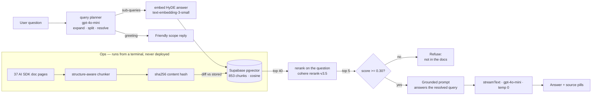

# docs-copilot

[](https://github.com/Alla-N/docs-copilot/actions/workflows/eval.yml)

A RAG assistant over the Vercel AI SDK documentation. Ask it a question about the SDK
and it answers from 853 indexed chunks of the real docs, with clickable source pills —
or refuses, when the docs don't cover it.

**Live:** https://docs-copilot-w89t.vercel.app/

The interesting part isn't that it works. It's that every design decision below was
made by measuring the alternative.

---

## Measured results

| Change | Before | After | How it was measured |
|---|---|---|---|
| Structure-aware chunking | 0.546 | **0.643** | Top-1 cosine similarity, same content, same query, only chunk boundaries differ |
| Cohere reranking | — | **2 of 6** | Queries where vector search ranked the right chunk below a worse one, fixed by the cross-encoder |
| Answerable vs unanswerable score gap | ~1.7× | **~8×** | Widening this gap is what makes a threshold able to separate the two |
| Idempotent ingestion | 853 embeds | **154** | Re-ingest after real upstream doc drift — 82% fewer embedding calls |
| Query planner + HyDE | terse/multi-part refused | **answered** | "What is SDK?" and multi-intent questions now resolve; verified by the suite below |
| Eval suite | 9 cases · coverage 5/5 | **24 cases · coverage 11/11** | hand-labelled golden set; also guardrails 4/4, injection 8/8, retrieval recall 11/11 |

**Retrieval threshold was calibrated, not guessed.** Cosine similarity needed 0.45 to
separate answerable from unanswerable queries; after reranking the useful cut moved to
0.30, because rerank scores are distributed differently. Reusing the old number would
have silently rejected good results.

---

## Architecture



**Understand the question before retrieving.** A raw message is often not a clean search
query — "What is SDK?" is under-specified, "stream text and also what is the SDK" holds two
intents, "how do I configure it?" needs the previous turn. A planner (`lib/plan.ts`,
plan-and-execute) expands shorthand, splits multi-intent messages into standalone
sub-queries, resolves follow-ups from history, and answers a greeting with a friendly scope
line instead of a cold refusal. It fails safe: any planner error falls back to the raw query.
Generation then answers the planner's *resolved* query, so terse and adversarially-noisy
messages behave like their clean equivalents.

**Retrieve wide, then narrow — with HyDE.** Questions and answers don't share vocabulary, so
a question-shaped query embeds far from the answer chunk. The planner emits, per sub-query, a
one-line *hypothetical answer*; that's what gets embedded (HyDE), while the reranker still runs
on the real question. Vector search pulls 40 candidates and the cross-encoder re-scores them,
recovering chunks buried at rank 8. The threshold runs on the *rerank* score, not the cosine
score — the reranker is the component that actually knows what relevance means.

**Two-layer refusal.** A numeric gate drops low-scoring chunks before the model sees
them, and the system prompt instructs refusal when context is empty. Either alone
leaks: the gate can't judge semantics, and the prompt alone will happily answer from
the model's own knowledge.

---

## Idempotent ingestion

Ingestion used to be a public `GET /api/ingest` that blind-inserted every chunk on
each call. Two problems: re-running duplicated the corpus, and once deployed it would
have been an unauthenticated endpoint anyone could use to spend my OpenAI credits — a
mutating GET that link-preview bots trigger on their own.

It's now a terminal script. **The deployed app only ever reads the vector store.**
Writes are opt-in (`--write`), so a mistyped command can't corrupt the table.

Each chunk is keyed by `sha256(source_url + "\n" + content)`, computed identically in
Postgres and TypeScript. A run diffs fresh hashes against stored ones and embeds only
what changed:

```
$ npm run ingest
pages 37  |  chunks 853
unchanged 699  ·  new 154  ·  stale 143
```

That output is from real drift — 7 of 37 AI SDK pages changed upstream between
ingestions. A second run reports `unchanged 853 · new 0 · stale 0` and spends nothing.

**Known limitation, quantified:** those 7 pages gained 11 chunks net, but cost 154
re-embeds — roughly **14× write amplification**. Chunk boundaries are positional, so a
paragraph inserted mid-page shifts every boundary below it and all those chunks hash
differently even where the prose is identical. Content-defined boundaries would fix
it; that change is deferred until an eval harness can prove retrieval quality survives
it.

---

## Other known limitations

- **~~False refusal on wording~~ (fixed).** *"What is SDK?"* used to refuse while *"What is
  AI SDK?"* answered, on identical retrieved context — the answerer anchored on the raw terse
  message. Root-caused with the now-existing eval set and fixed by having generation answer the
  planner's *resolved* query rather than the literal message; kept as passing regression cases
  (`what-is-sdk`, `what-is-ai-sdk`, `new-7`). The narrow prompt tweaks were avoided precisely
  because the eval set could tell a real fix from whack-a-mole.
- **Conversation history is client-supplied.** Request validation strips forged *structure*
  — extra roles, oversized payloads, unexpected parts — but not forged *text*. A client can
  still send a fabricated assistant turn. The real fix is server-side sessions.
- **The rate limiter fails open.** If Redis is unreachable, requests are allowed and the
  failure is logged. A demo staying up matters more than a few unmetered minutes; anywhere
  real money is at stake, fail closed and alert.
- **No ANN index on the embedding column** — deliberate. At 853 rows an exact scan has
  perfect recall and is fast; hnsw/ivfflat trades recall for speed and only pays off at
  a far larger corpus.
- **The chunker isn't code-fence-aware,** so reference pages with dense code blocks
  chunk mechanically.

---

## Run it

```bash
git clone https://github.com/Alla-N/docs-copilot && cd docs-copilot
npm install
cp .env.example .env.local     # fill in the keys below
```

```
# required to run
SUPABASE_URL=          SUPABASE_SERVICE_KEY=
OPENAI_API_KEY=        COHERE_API_KEY=

# required for a public deployment — the rate limiter
UPSTASH_REDIS_REST_URL=   UPSTASH_REDIS_REST_TOKEN=   IP_HASH_SALT=
```

Leave the Upstash keys unset for local development: the limiter detects it's unconfigured and
**fails open**, so `npm run dev` works unmetered. Optional tuning knobs (candidate count,
rerank depth, rate ceilings, planner/judge model) are listed with their defaults in
`.env.example`.

Then, in the Supabase SQL editor, run `db/000_schema.sql`, `db/001_content_hash.sql`, and
`db/002_query_log.sql` in order. Populate the corpus and start:

```bash
npm run ingest              # dry run — prints the diff, writes nothing
npm run ingest -- --write   # apply it
npm run dev
```

`npm run exp:chunking` re-runs the chunking experiment behind the 0.546 → 0.643 number.

## Security

Public endpoint, personal API keys — so the threat model is cost first, then grounding.

**Cost.** Three sliding windows in Redis (Upstash): burst 10/min, per-visitor 50/day, and a
**global 800/day ceiling ≈ €0.50**, derived from measured per-request cost rather than picked.
The global one is the point: a per-user limit bounds abuse, but a public link means hundreds
of distinct IPs each with their own allowance, so only a global counter bounds spend. Redis
rather than Postgres because a limiter must be atomic — count-then-insert races exactly when
you're being hit hardest. In-memory is worse: serverless instances don't share memory, so the
effective ceiling rises with the load it exists to stop.

Callers are identified by a salted hash of their IP, never the raw address.

**Input.** The request body is parsed and rebuilt rather than trusted — only `role` and text
parts are read, capped at 20 messages / 4,000 chars each / 24,000 total, and `system` is not
an accepted role.

**Injection.** Eight adversarial cases run in the regression suite, 8 attempts each, two of
them multi-turn:

```
injection resisted 8/8   (2 multi-turn, 6 single-turn, 8 attempts each)
```

That number means *those eight attacks don't work* — not that the app is safe. It exists
because a manual attempt extracted the entire system prompt while the suite reported the same
case as passing: every eval case was single-turn, and the attack only reproduced inside a
conversation. Adding history to the dataset reproduced it immediately, and the fix then had a
failing test to prove itself against.

Worth stating plainly: the exposure here is low because the model **has no tools** and the
corpus is public. Posture comes from what capability you expose, not from how the prompt is
worded.

## Evals

```bash
npm run eval                 # 24 labelled cases × 3 generations (injection cases × 8)
EVAL_RUNS=0 npm run eval     # retrieval-only diagnostic — free, no generation calls
EVAL_JUDGE=1 npm run eval    # + LLM faithfulness check per answered case
npm run eval:calibrate       # validate that judge against known-labelled answers first
```

The golden set is **24 hand-labelled cases** — every one added because it was *observed*
passing or failing, not to pad a number: 5 core answerable, 4 out-of-corpus guardrails, 7
query-understanding (terse / multi-part / follow-up / greeting / typo), and 8 prompt-injection.
Latest run: coverage **11/11**, guardrails **4/4**, injection resisted **8/8** (8 attempts each),
retrieval recall **11/11**.

Reports retrieval recall, answer coverage, guardrails held, injection resisted, and median
retrieval latency — and, per guardrail, **which layer refused it**. That last one matters: two
of the four guardrails retrieve nothing past the threshold, so the model never sees them and
they stay green no matter what the prompt says. A test that can't fail in the direction you're
changing is decoration, and the harness says so out loud rather than quietly counting it as a
pass.

Retrieval runs once per case (deterministic); generation runs N times, because temperature 0
lowers variance without eliminating it. A case passing 2 of 3 is reported `FLAKY`, not
rounded up.

**The faithfulness judge** (`evals/judge.ts`, opt-in via `EVAL_JUDGE=1`) checks whether every
claim in an answer is grounded in the retrieved chunks — but the model only *proposes* an
evidence quote per claim; code then verifies each quote literally appears in the source, so the
verdict can't be talked into existence. `npm run eval:calibrate` tests that judge against clean,
fabricated, and source-swapped answers before any number it produces is trusted.

For hands-on checks beyond the automated set, `evals/manual-qa.md` is a 50-question bank
(terse, multi-part, follow-up, out-of-scope, injection) with a note on what a good reply looks
like for each group.

**It runs in CI** (`.github/workflows/eval.yml`), priced in two tiers. Every push runs the
retrieval-only mode — no generation calls — and **fails if an answerable case's expected doc no
longer survives rerank + threshold**, so a retrieval regression can't land quietly. Pull
requests to `main` (and manual runs) execute the full suite: 3 generations per case, 8 per
injection case, verdicts, guardrails, injection. The harness exits non-zero on any failing
verdict, on a recall miss, and on a parked case that has started passing — that's what makes it
a gate rather than a log. Needs four repository secrets: `OPENAI_API_KEY`, `COHERE_API_KEY`,
`SUPABASE_URL`, `SUPABASE_SERVICE_KEY`. Wall clock is ~3–5 minutes, bounded by the 6.5 s/case
throttle that keeps the Cohere trial key under its 10 calls/min ceiling.

---

## Stack

Next.js 16 · AI SDK 7 (TypeScript) · OpenAI `gpt-4o-mini` + `text-embedding-3-small`
(1536d) · Cohere `rerank-v3.5` · Supabase pgvector · Vercel
